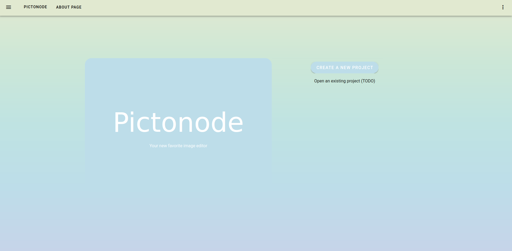
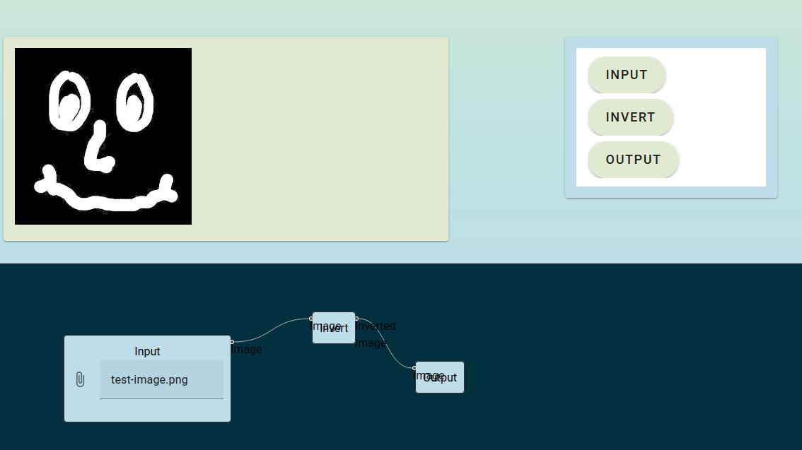

# Pictonode

Pictonode is an image editor using a revolutionary node-based system that allows for greater flexibility and reproducibility. The end goal is to make image processing a parallelized process that anyone can take part in, regardless of their technical background. In addition, we also aim to allow those already familiar with contemporary image editing software to easily transition to Pictonode. 

The web backend for Pictonode is currently live at http://pictonode.com.

## Screenshots

**Web Frontend**

## Credits

- The web interface was written by John Nunley (@notgull) and Grace Meredith (@meredith-grace).
- The shared backend "Ontario" was written by John Nunley and Parker Nelms (@parkern342).
- The GIMP frontend was written by Parker Nelms and Stephen Foster (@Stehfyn).

## License

This entire project is released under the GNU Affero General Public License version 3 with anime exceptions. Those last three words are a joke. The full license can be found in the [LICENSE](./LICENSE) file.
